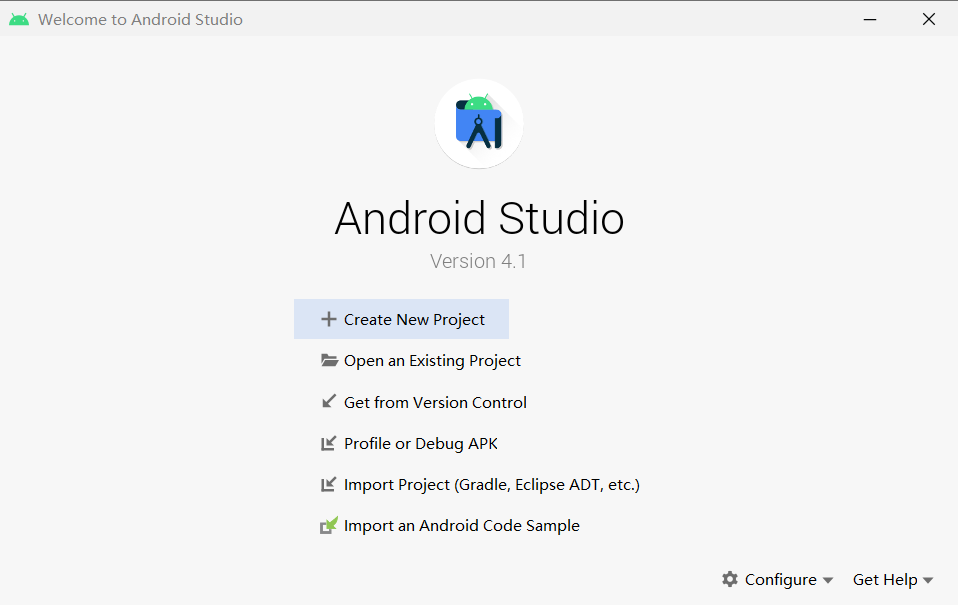
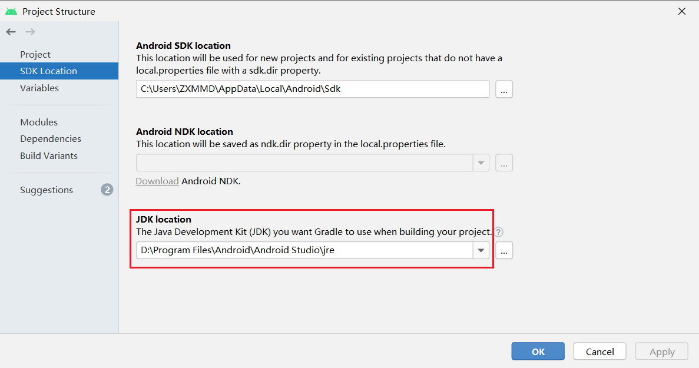
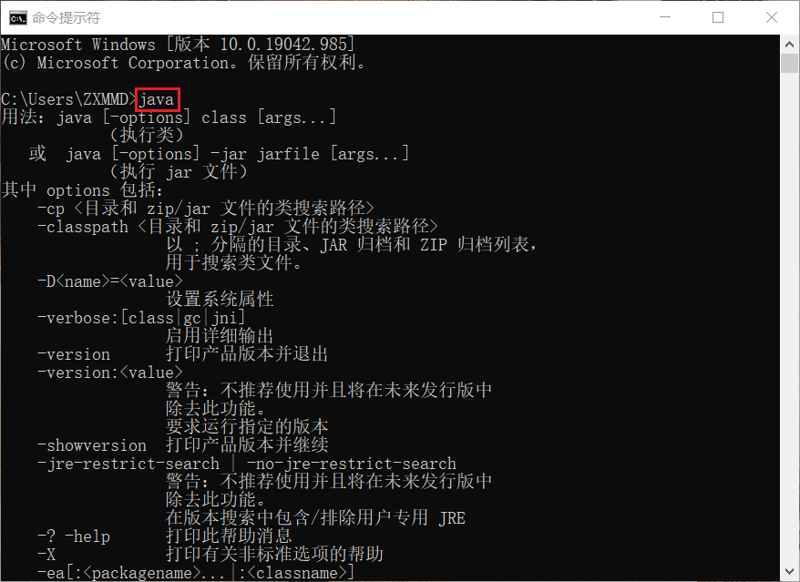
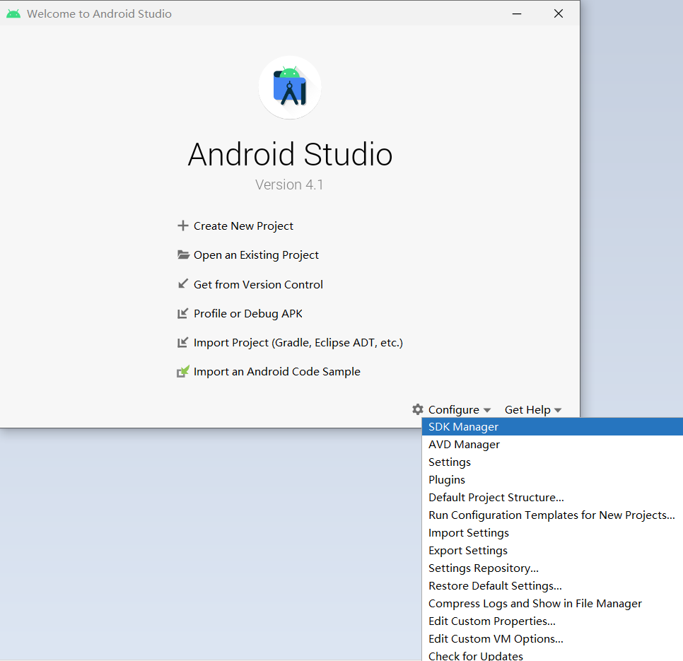
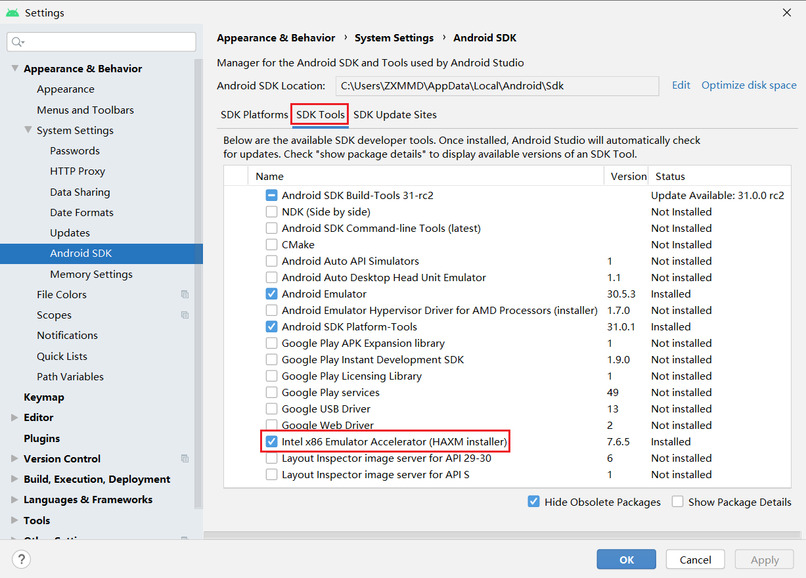
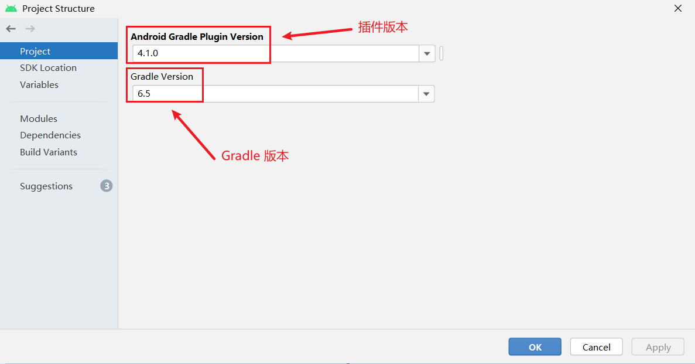
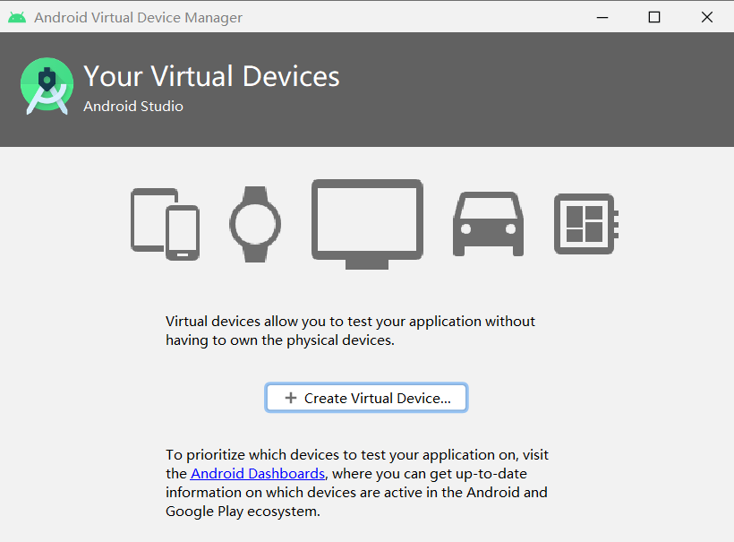
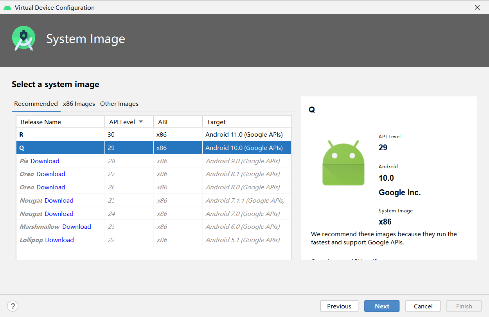
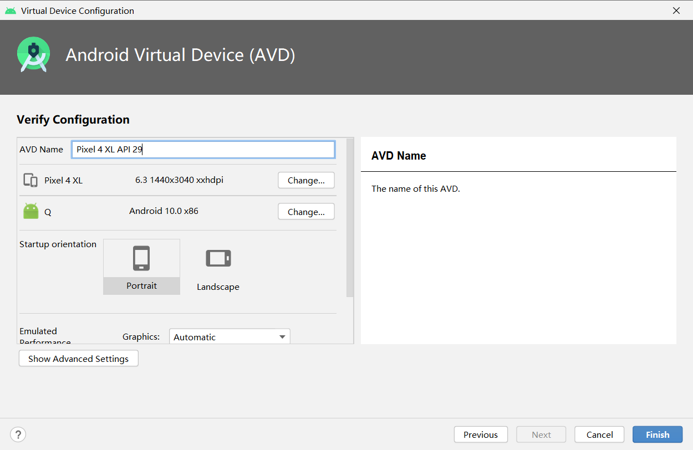
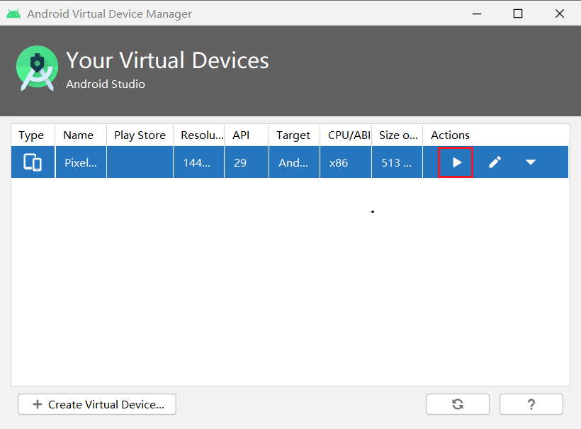

# 第五章实验报告

## 实验环境

+ Windows 10

+ Android Studio

## 实验过程

### 安装Android Studio

+ 通过官方网站下载[Android Studio](https://developer.android.com/studio/)最新版本并根据提示安装，安装 `Android Studio` 的过程中可能会提示联网下载更新    `Android SDK` 。

  

### 安装和配置 Java SDK

+ `Android Studio` 安装后已经内置了 `Java` 运行时环境，通过菜单 `File -> Project Structure -> SDK Location` 可以查看到 `Android Studio` 在编译当前项目时使用的 `JDK` 目录。

  

+ 检验是否安装成功

  

### 下载安装 Android SDK

+ 在启动 `Android Studio` 之后可以通过启动界面的菜单选项 `Configure -> SDK Manager` 启动 `SDK Manager` 。

  

+ `SDK Manager` 的 `SDK Platforms` 选项卡可以选择不同版本的 `SDK` 下载安装。可以看到已经默认安装了 `Android 11.0`。

  

### 配置 Android 模拟器运行环境

+ 在 `PC / Mac` 上运行 `Android` 模拟器强烈建议必须安装 `Intel x86 Emulator Accelerator (HAXM installer)`，并且配合使用 `ABI` 类型为 `x86/x86_64` 的模拟器以获得最流畅的模拟器使用体验。

  

### 配置 Gradle 编译环境

+ 通过菜单 `File -> Project Structure -> Project` 可以查看到 `Gradle 版本` 和 `Android Studio Gradle 插件版本` 。

  

### 在 Android 模拟器上运行应用

+ 创造一个虚拟设备

  

+ 选择 `Phone` 

  选择系统

  

+ 确认配置

  

+ 点击 `Actions` 下方的三角形符号，开始运行

  

## 参考资料

+ [第五章 智能操作系统安全基础](https://c4pr1c3.github.io/cuc-mis/chap0x05/exp.html)

+ [Android 官方文档](https://developer.android.com/studio/run/emulator)

+ [Android Studio报错unable to access android sdk add-on list解决方案](https://blog.csdn.net/u010358168/article/details/81535307)