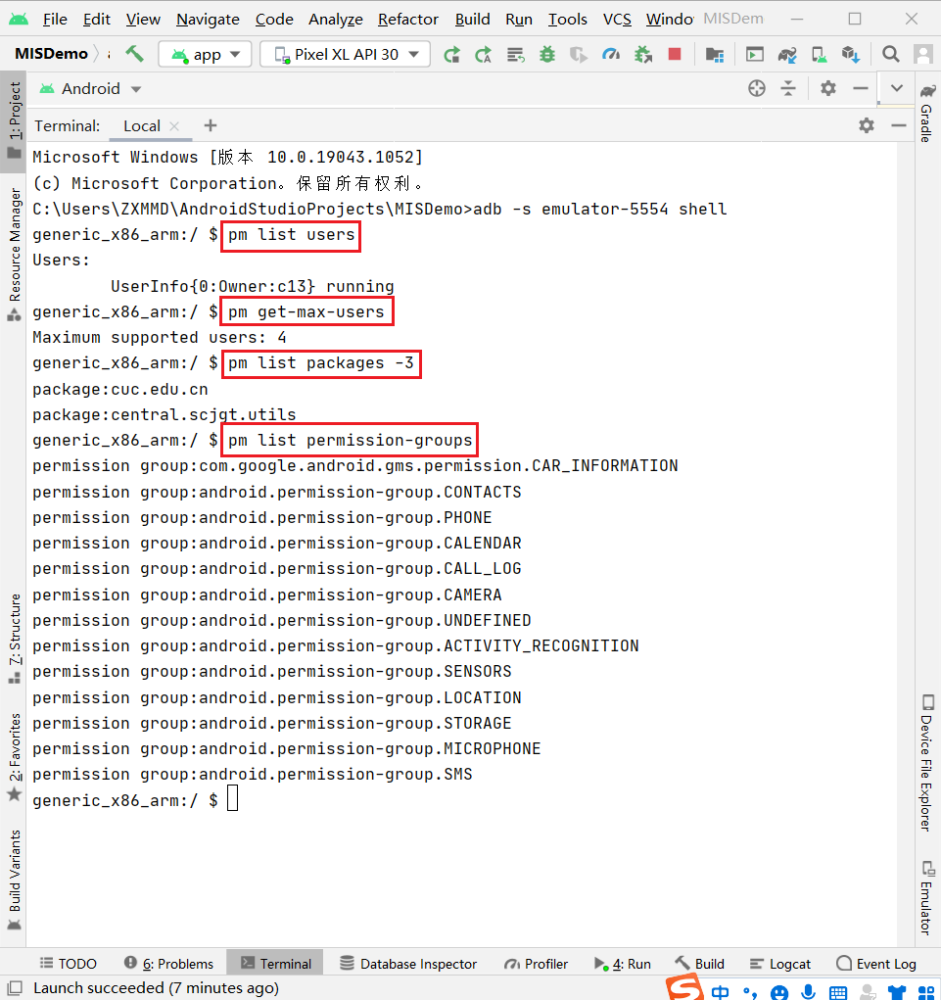

# 

## 实验环境

+ Android Studio 4.2.1
+ AVD: Android 11.0 API 30 x86 - Pixel XL

## ADB实验



## HelloWorld v1

认真阅读Android官方给出的[使用Android Studio一步一步创建并运行的Hello World程序指南](https://developer.android.google.cn/training/basics/firstapp/creating-project.html)，根据[课本](https://c4pr1c3.github.io/cuc-mis/chap0x06/exp.html#hello-world-v1)要求进行如下设置：

+ Application Name设置为：MISDemo

+ Company Domain设置为：cuc.edu.cn

运行结果：

回答问题如下：

1.按照向导创建的工程在模拟器里运行成功的前提下，生成的APK文件在哪儿保存的？

+ 如下图所示：

  

2.使用`adb shell`是否可以绕过`MainActivity`页面直接“唤起”第二个`DisplayMessageActivity`页面？是否可以在直接唤起的这个`DisplayMessageActivity`页面上显示自定义的一段文字，比如：你好移动互联网安全

+ 可以。


3.如何实现在真机上运行你开发的这个Hello World程序？

+ 将生成的apk文件传输到手机上安装运行


4.如何修改代码实现通过 `adb shell am start -a android.intent.action.VIEW -d http://sec.cuc.edu.cn/ `可以让我们的 `cuc.edu.cn.misdemo` 程序出现在“用于打开浏览器的应用程序选择列表”？

```bash
# 在 MISDemo\app\src\main\AndroidManifest.xml 中添加以下代码
<action android:name="android.intent.action.VIEW" />
<category android:name="android.intent.category.DEFAULT" />
<category android:name="android.intent.category.BROWSABLE" />
<data android:scheme="http" />
```

+ 在`AndroidManifest.xml`中做出相应修改


## HelloWorld v2

+ 不会做

## 参考资料

+ [第六章 安卓系统访问控制策略与机制](https://c4pr1c3.github.io/cuc-mis/chap0x06/exp.html)
+ [Android Studio开发者文档](https://developer.android.google.cn/studio/intro)
+ [“adb”不是内部或外部命令，也不是可运行的程序或批处理文件——解决方案](https://blog.csdn.net/y201314an/article/details/81022556)
