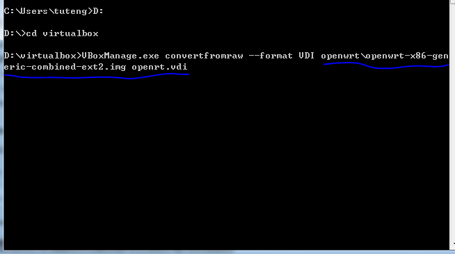

# 实验一：OpenWrt 虚拟机搭建
## 实验目的：
- 熟悉基于OpenWrt的无线接入点（AP）配置
- 为第二章，第三章和第四章实验准备好[无线软AP]环境
## 实验环境
- 可以开启监听模式、AP 模式和数据帧注入功能的 USB 无线网卡
- Virtualbox
## 实验要求
- 对照第一章实验无线路由器/无线接入点（AP）配置列的功能清单，找到在OpenWrt中的配置界面并截图证明；
- 记录环境建设步骤；
- 如果USB无线网卡能在OpenWrt中正常工作，则截图证明；
- 如果USB无线网卡不能在OpenWrt中正常工作，截图并分析可能的故障原因并导致可能的解决方法。

## 实验步骤
### 安装OpenWrt步骤如下所示
#### 1下载wget镜像文件

#### 2 解压缩得到下图  

#### 3格式转换
#### 4 新建虚拟机，并更改内存设置为256  

#### 5 利用虚拟硬盘文件注册新虚拟硬盘文件选择刚才转换生成的 .vdi 文件得到新的虚拟机openwrt

  
- 根据已有的vdi创建openwrt虚拟机，并设置网卡和串口
> - 第一块网卡设置为：Intel PRO/1000 MT 桌面（仅主机(Host-Only)网络）
> - 第二块网卡设置为：Intel PRO/1000 MT 桌面（网络地址转换(NAT)）
    
开启虚拟机  

- AP管理密码设置
- 配置DHCP
- 开启日志记录功能
- 配置AP隔离
- 设置MAC地址过滤的规则
- 查看WPS功能的支持情况
- 查看AP/无线路由器支持的工作模式

## 参考资料
[黄大](https://c4pr1c3.github.io/cuc-mis/chap0x01/exp.html)

